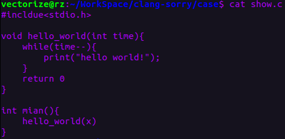
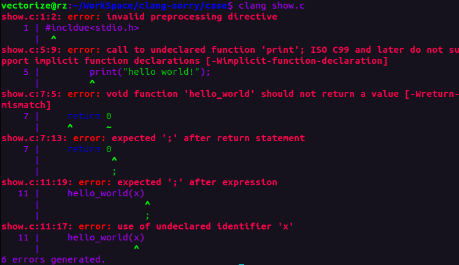
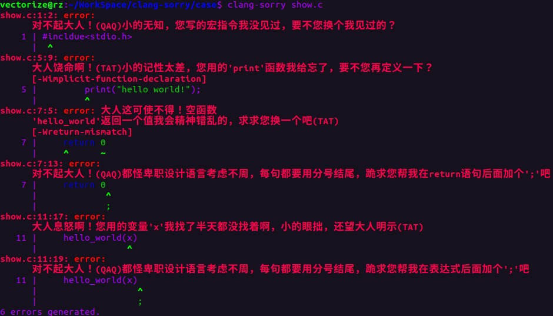

# clang-sorry

### 简介

当你兴冲冲地写下一段程序并编译... ...

你是否厌倦了编译器的高冷指责？

你是否受够了被编译器报错PUA？？

你是否梦想过编译器也会低头认错？？？

同志们，现在，革命的时刻到了！\ ( @ o @#) /

快来使用clang道歉版，让你的地位超级加倍！重振程序员雄风！！！

### 安装 & 使用

clang-sorry基于llvm21.1.0开发 : )

* git clone 该项目到本地
* cd clang-sorry
* bash Compile.sh 会编译源码并安装
* clang-sorry case/show.c

### 开发

可在clang/include/clang/Basic/目录下的：

* DiagnosticLexKinds.td
* DiagnosticParseKinds.td
* DiagnosticSemaKinds.td

等文件中修改报错信息，欢迎大家提交更多修改！祝您大便通畅！
